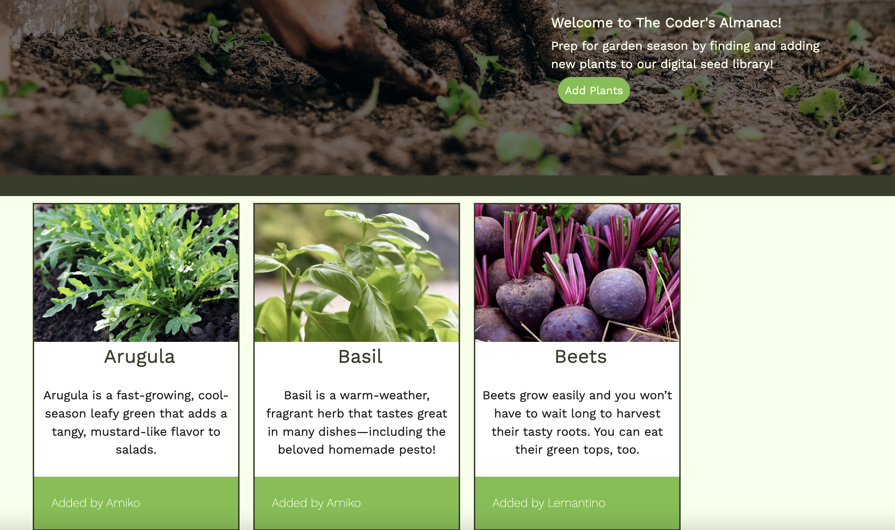
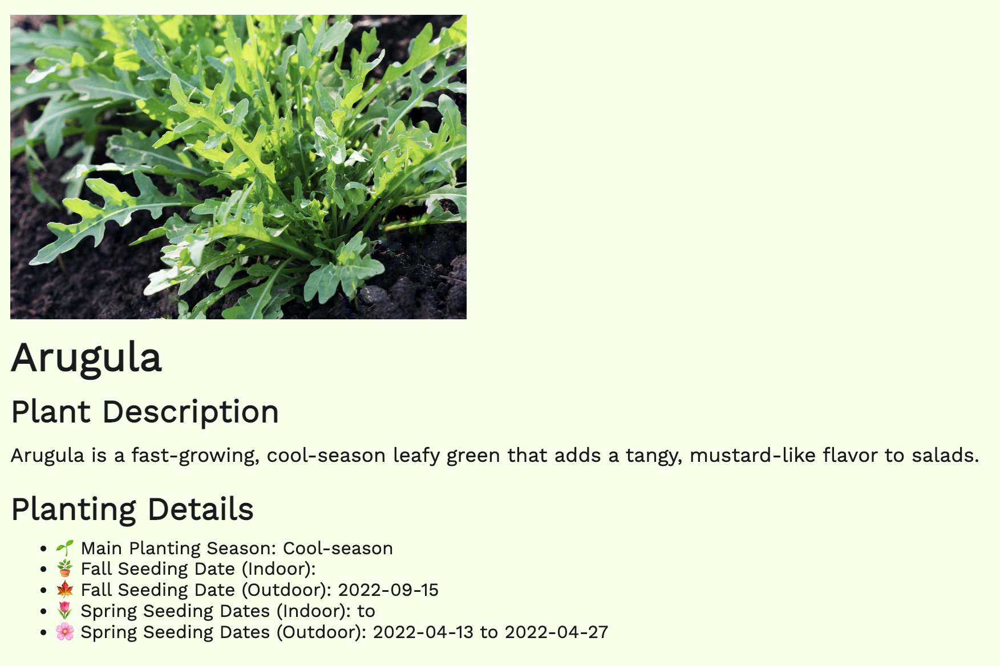

# coders-almanac

## Description

The Coder's Almanac is a digital seed library that allows tech-savvy gardeners to input their seed and planting information for their garden into one database. 

As gardeners, it can be difficult to have all of your seed information together when you get ready for planting season. You may have leftover seeds that are in ziploc bags or have plant books that are heavy to lug around while you are outside. Now, you can plant your seeds in time for their season just by opening up The Coder's Almanac on your phone while you're working outside.

We learned that it's more difficult than it looks to have the data you need moved from one database onto multiple pages. But we also have many features we want to add to this resource as it's a handy tool for beginner and veteran gardeners alike.

## Table of Contents (Optional)

If your README is long, add a table of contents to make it easy for users to find what they need.

- [Installation](#installation)
- [Usage](#usage)
- [Credits](#credits)
- [License](#license)

## Installation

In order to open The Coder's Almanac, you will have to download all files from this project. Install Express.js, Inquirer, and node.js (npm install express, npm install i, npm i)  using the integrated terminal. The user should also run mysql to gain access to the database using "mysql -u root -p" and "source db/schema.sql" before running the seed data (npm run seed) and server (npm start).

To open up the application outside of terminal, the user should go to http://localhost:3001 to view the application.

## Usage

The intended use of this application is to find and upload plant seed data to our digital seed library.

The user can find all plants and their seed information through the homepage cards. After clicking on the plant cards, the user will be taken to the plant details page where they will find the planting and seasonal information related to the plant. 

If a user wants to add more details about their seeds or plants not currently listed in the digital library, they can add a new plant through our "Add a New Plant" form that includes all of the seeding dates.

See the full application video here: (https://www.youtube.com/watch?v=0iCqN_xj-bU)

## Credits

Collaborators:
Austin Fu, [https://github.com/fubaru]
Joshua Rinehart, [https://github.com/codeBiskut]
Joe Kumher, [https://github.com/joekumher]
Erin Maxson, [https://github.com/erin-maxson]

Always a shoutout to Brian Baker [https://github.com/baker-ling] and Phil Loy for helping us where we got stuck on this project.

## License

See our MIT License here: [MIT License](LICENSE.md)

## Badges

## How to Contribute

If you created an application or package and would like other developers to contribute it, you can include guidelines for how to do so. The [Contributor Covenant](https://www.contributor-covenant.org/) is an industry standard, but you can always write your own if you'd prefer.