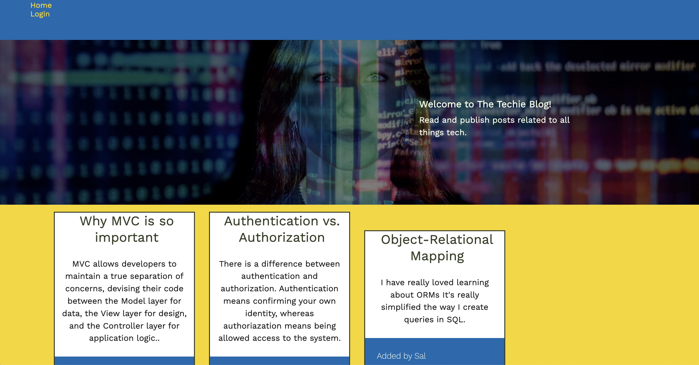
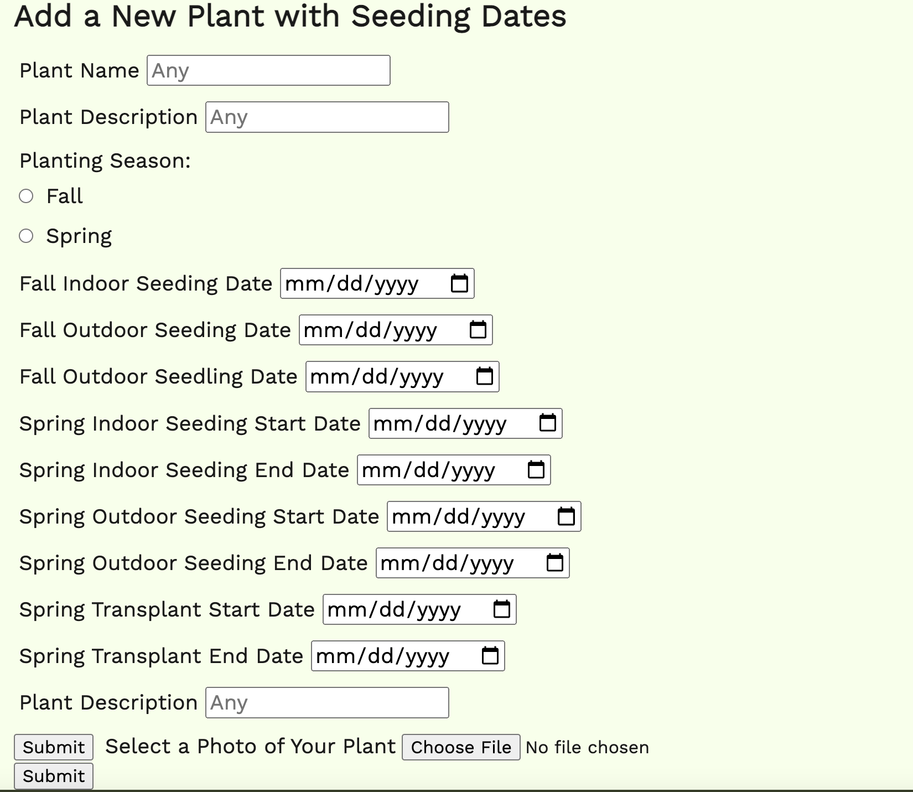

# tech-blog

## Description

The Tech Blog is meant for users how want to post and comment on tech-related pieces. Using MVC structure and handlebars, I was able to create this project using the same structure we used for our second group project. The goal of this was to show how handlebars and MVC work together through the templated frontend and separation of files to make it easier to debug and connect APIs in the backend. Users are able to log in and add posts inside the blog, but if they log out, they'll only be able to see up to 9 blog posts/comments.

## Table of Contents (Optional)

If your README is long, add a table of contents to make it easy for users to find what they need.

- [Installation](#installation)
- [Usage](#usage)
- [Credits](#credits)
- [License](#license)

## Installation

In order to open The Tech Blog, you will have to download all files from this project. Install Express.js, Inquirer, and node.js (npm install express, npm install i, npm i)  using the integrated terminal. The user should also run mysql to gain access to the database using "mysql -u root -p" and "source db/schema.sql" before running the seed data (npm run seed) and server (npm start).

To open up the application outside of terminal, the user should go to http://localhost:3001 to view the application.

To view the application on Heroku, the user must visit https://techie-blog-erinm.herokuapp.com/.

## Usage

The intended use of this application is to read and upload tech blogs/comments.

The user can find all plants and their seed information through the homepage cards. After clicking on the plant cards, the user will be taken to the plant details page where they will find the planting and seasonal information related to the plant. 

If a user wants to add more details about their seeds or plants not currently listed in the digital library, they can add a new plant through our "Add a New Plant" form that includes all of the seeding dates.

See the full application video here: (https://www.youtube.com/watch?v=0iCqN_xj-bU)

## Credits
Using the previous group project, I was able to create this Tech Blog. Without the previous help of my team members, this process would have been much longer.

Collaborators:
Austin Fu, [https://github.com/fubaru]
Joshua Rinehart, [https://github.com/codeBiskut]
Joe Kumher, [https://github.com/joekumher]
Erin Maxson, [https://github.com/erin-maxson]

Always a shoutout to Brian Baker [https://github.com/baker-ling] and Phil Loy for helping us where we got stuck on this project.

## License

See our MIT License here: [MIT License](LICENSE.md)

## Badges

## How to Contribute

If you created an application or package and would like other developers to contribute it, you can include guidelines for how to do so. The [Contributor Covenant](https://www.contributor-covenant.org/) is an industry standard, but you can always write your own if you'd prefer.